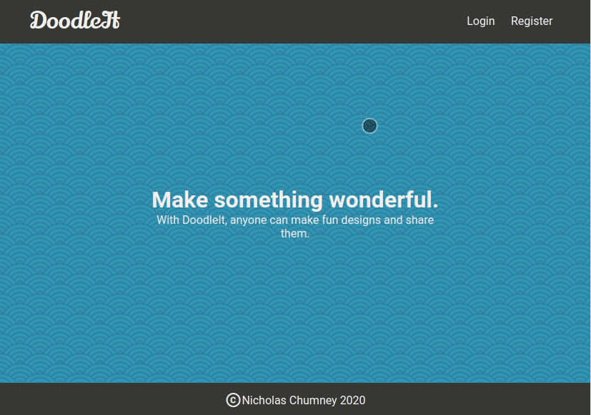

# Doodle It: Make Something Wonderful

## About this project

Doodle It is a web application that allows users to build images
in thier browser. It utlilizes the [Fabric.js Canvas Library](http://fabricjs.com/)
to allow drag and drop shapes on a canvas, and runs on React. It is served by an API
server that is built using Express/Node.js and stores data on MongoDB.

### Demo



### Built With

- React
- Node.js
- MongoDB

## Getting Started

1) Clone this repo,

```bash
git clone https://github.com/chumnend/doodle-it.git
```

2) Install dependencies with

```bash
yarn
```

3) Go into the `doodle-it-api` app. Then copy the `env.example` file and fill it out. After return to the project root.

```bash
cd apps/doodle-it-api
cp env.example .env.example
cd ../..
```

4) Go into the `doodle-it-ui` app. Then copy the `env.example` file and fill it out. After return to the project root.

```bash
cd apps/doodle-it-ui
cp env.example .env.example
cd ../..
```

5) Start the application in dev mode,

```bash
yarn dev
```

## Deployment

Not currently deployed.

## Contact

Nicholas Chumney - [nicholas.chumney@outlook.com](nicholas.chumney@outlook.com)
